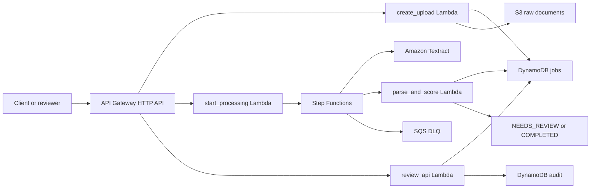

# DocuFlow OCR

DocuFlow OCR is a product-facing accounts payable invoice-processing app with a Cloudflare Pages frontend and a serverless AWS backend. It accepts invoice PDFs/images, runs asynchronous Textract OCR through Step Functions, normalizes extracted fields with Python Lambda, and routes low-confidence invoice totals or vendor fields into a finance review workflow. It is built as a recruiter-readable cloud engineering portfolio project: infrastructure is defined in Terraform, workflow state is observable in AWS, parser logic is unit tested with mock Textract fixtures, and the frontend can run as a polished demo or connect to the deployed API.

## TLDR

DocuFlow OCR turns vendor invoices into review-ready accounting records. The frontend presents a polished Accounts Payable product demo, while the backend shows production-style cloud engineering: presigned uploads, asynchronous OCR orchestration, confidence scoring, durable job state, human review, audit records, Terraform infrastructure, and local tests around the document-parsing logic.

## About

This project models a common accounts payable problem: finance teams receive vendor invoices as PDFs or images, copy fields by hand, and need a way to automate repeatable extraction while still reviewing uncertain results. DocuFlow OCR demonstrates the core AWS pieces needed for that workflow: presigned intake, event-style processing, OCR orchestration, confidence scoring, durable job state, review APIs, audit records, and operational failure handling.

Hosted demo: [https://docuflow-ocr.pages.dev](https://docuflow-ocr.pages.dev). The frontend runs as a polished invoice-processing product demo; the backend is designed to be deployed into an AWS account with Terraform.

## Tech Stack

| Area | Technology |
| --- | --- |
| Cloud | AWS |
| Frontend | React, TypeScript, Vite, Cloudflare Pages |
| Infrastructure | Terraform |
| API | API Gateway HTTP API |
| Compute | Python 3.12 AWS Lambda |
| OCR | Amazon Textract `StartDocumentAnalysis` with `FORMS` and `TABLES` |
| Orchestration | AWS Step Functions |
| Storage | S3 for raw uploads and raw Textract JSON |
| Data | DynamoDB jobs table and audit table |
| Failure handling | SQS dead-letter queue |
| Observability | CloudWatch log groups and alarms |
| Testing | Pytest, Ruff, synthetic Textract fixtures |

## Engineering Highlights

- Implements a presigned upload flow that creates a DynamoDB job record and scopes raw S3 objects by owner and job ID.
- Adds a Cloudflare Pages frontend that presents the project as a sellable OCR review product, with demo mode for hiring-manager walkthroughs and live API mode through `VITE_API_BASE_URL`.
- Uses Step Functions to coordinate validation, asynchronous Textract start, wait/poll behavior, raw OCR persistence, parsing, confidence scoring, routing, retries, and failure handling.
- Parses Textract key-value blocks into normalized invoice fields such as `vendor_name`, `invoice_number`, `document_date`, `total_amount`, and remittance contact details, while still supporting generic fields for other document types.
- Routes low-confidence or incomplete extractions to `NEEDS_REVIEW` instead of pretending OCR is always reliable.
- Provides review endpoints to list queued jobs, inspect extracted fields, submit corrected values, approve or reject a document, and write audit records.
- Keeps infrastructure reproducible with Terraform and includes CloudWatch alarms for failed Step Functions executions and DLQ depth.
- Tests parser, confidence scoring, and review status transitions locally without AWS calls.

## Architecture

The main architecture docs are in:

- [docs/architecture.md](docs/architecture.md) for the C4-style container diagram, runtime flow, deployment shape, and constraints.
- [docs/adrs/README.md](docs/adrs/README.md) for concise architecture decision records.
- [docs/use-cases.md](docs/use-cases.md) for Accounts Payable invoice positioning and other enterprise OCR use cases.
- [docs/manual-to-automation.md](docs/manual-to-automation.md) for the manual review and automation path.

At a high level:



## Repository Layout

```text
.
├── infra/                 # Terraform for AWS resources
├── frontend/              # Cloudflare Pages React product frontend
├── scripts/               # Lambda packaging helper
├── src/lambdas/           # Python Lambda handlers and shared package
├── src/tests/             # Unit tests and mock Textract fixtures
├── docs/                  # Architecture, ADRs, API examples, review flow, resume bullets
├── samples/               # Synthetic sample-document guidance
├── Makefile
└── AGENTS.md
```

## API Summary

| Method | Path | Purpose |
| --- | --- | --- |
| `POST` | `/uploads` | Create a job and return a presigned S3 upload URL |
| `POST` | `/jobs/{job_id}/start` | Start Step Functions processing after upload |
| `GET` | `/jobs/{job_id}` | Fetch job status and metadata |
| `GET` | `/jobs/{job_id}/result` | Fetch extracted fields and confidence data |
| `GET` | `/review/jobs` | List jobs in `NEEDS_REVIEW` |
| `GET` | `/review/jobs/{job_id}` | Fetch one review job |
| `POST` | `/review/jobs/{job_id}/decision` | Approve or reject with optional corrections |

More request and response examples are in [docs/api-examples.md](docs/api-examples.md).

## Data Model

The jobs table is keyed by `job_id` and uses a `status-created_at-index` GSI for the review queue. Status values are:

`CREATED`, `UPLOADED`, `PROCESSING`, `COMPLETED`, `NEEDS_REVIEW`, `FAILED`, `APPROVED`, `REJECTED`.

Raw documents and raw Textract JSON stay in S3. Normalized fields, confidence scores, review corrections, and status are stored in DynamoDB. Review decisions are also written to a dedicated audit table.

## Prerequisites

- Python 3.12
- Terraform 1.6+
- AWS CLI credentials with permission to create S3, DynamoDB, Lambda, API Gateway, Step Functions, SQS, IAM, and CloudWatch resources
- An AWS region where Textract supports document analysis, such as `us-east-1`

## Local Development

```bash
make install
make test
make lint
make fmt
make package
make frontend-install
make frontend-build
make tf-fmt
make tf-validate
```

`make package` creates Lambda zip files in `build/lambda/`. Run it before `terraform apply`.

Run the frontend locally:

```bash
make frontend-install
make frontend-dev
```

The frontend works without an API URL in demo mode. To connect it to a deployed backend, set:

```bash
VITE_API_BASE_URL="https://your-api-id.execute-api.us-east-1.amazonaws.com"
```

## Deploy

```bash
make install
make test
make package
terraform -chdir=infra init
terraform -chdir=infra apply
```

Capture the API base URL:

```bash
API_BASE="$(terraform -chdir=infra output -raw api_base_url)"
```

## Deploy Frontend To Cloudflare Pages

The frontend build output is `frontend/dist`, and `frontend/wrangler.toml` sets the Pages project name to `docuflow-ocr`.

Manual deploy:

```bash
cd frontend
npm install
npm run build
npx wrangler pages deploy dist --project-name docuflow-ocr --branch main
```

GitHub Actions deploy is configured in `.github/workflows/deploy-frontend.yml`. It expects:

- GitHub secret `CLOUDFLARE_API_TOKEN`
- GitHub secret `CLOUDFLARE_ACCOUNT_ID`
- Optional GitHub variable `VITE_API_BASE_URL`

## Demo Script

Create an upload job:

```bash
curl -s -X POST "$API_BASE/uploads" \
  -H "content-type: application/json" \
  -d '{"filename":"sample-invoice.pdf","content_type":"application/pdf","owner_id":"demo"}'
```

Upload a PDF to the returned `upload_url`:

```bash
curl -X PUT "$UPLOAD_URL" \
  -H "content-type: application/pdf" \
  --upload-file samples/sample-invoice.pdf
```

Start processing:

```bash
curl -s -X POST "$API_BASE/jobs/$JOB_ID/start"
```

Poll status and result:

```bash
curl -s "$API_BASE/jobs/$JOB_ID"
curl -s "$API_BASE/jobs/$JOB_ID/result"
```

Review low-confidence jobs:

```bash
curl -s "$API_BASE/review/jobs"
curl -s -X POST "$API_BASE/review/jobs/$JOB_ID/decision" \
  -H "content-type: application/json" \
  -d '{"decision":"APPROVE","reviewer":"aiden","corrected_fields":{"total_amount":"421.19"}}'
```

## Privacy And Security

- No secrets, credentials, real customer data, or private documents are committed.
- The unit tests use synthetic Textract JSON fixtures instead of live AWS calls.
- Terraform creates IAM roles for the deployed services; Lambda code does not require hard-coded AWS credentials.
- The first version intentionally does not include authentication, so do not expose review endpoints publicly for production use without adding auth and owner-scoped authorization.
- The frontend demo mode uses synthetic product data when no API URL is configured.

## Cost Notes

The design is low-cost for demos: on-demand DynamoDB, Lambda, API Gateway HTTP API, SQS, Step Functions, S3 storage, and Textract per-page processing. Textract is the main cost driver. Delete test documents and run teardown when finished.

## Teardown

```bash
terraform -chdir=infra destroy
```

The S3 bucket uses `force_destroy = true` so Terraform can remove demo uploads during teardown.

## Troubleshooting

- `terraform apply` fails because Lambda zip files are missing: run `make package`.
- Textract fails with access or region errors: confirm AWS credentials, region support, and IAM permissions.
- Job stays in `PROCESSING`: inspect the Step Functions execution and Lambda logs in CloudWatch.
- Job goes to `NEEDS_REVIEW`: inspect `confidence.review_reasons` on the job item.
- Failed executions are captured by the Step Functions failure path and sent to the SQS DLQ.

## Scope Limits

This first version does not include Cognito, multi-tenant authorization, custom ML, payment processing, or long-term document retention policies. The intended hiring signal is the end-to-end product shape: Cloudflare Pages frontend, upload, OCR, orchestration, parse, score, route, review, observe, and tear down.
