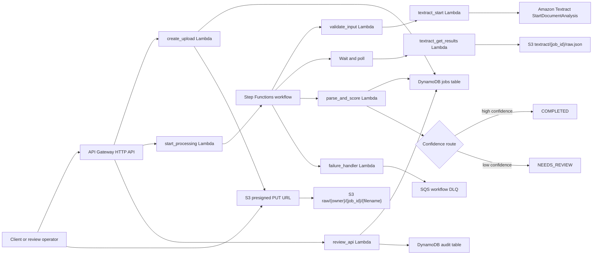

# DocuFlow OCR

DocuFlow OCR is a portfolio-ready AWS serverless document intake system. It demonstrates presigned S3 uploads, API Gateway workflows, Step Functions orchestration, Textract OCR, Python Lambda parsing, DynamoDB status tracking, human review for low-confidence extraction, SQS dead-letter handling, CloudWatch alarms, and Terraform deployment.

## Architecture



## What This Proves

- Document intake: API creates a job, returns a presigned upload URL, and stores raw files in S3.
- Workflow automation: Step Functions validates input, starts Textract, polls results, parses fields, scores confidence, and routes outcomes.
- Human-in-the-loop review: low-confidence jobs are listed through review endpoints, corrected, approved, rejected, and audited.
- Operational readiness: retries, catches, DLQ capture, CloudWatch log groups, alarms, Terraform teardown, and fixture-backed unit tests.

## Repository Layout

```text
.
├── infra/                 # Terraform for AWS resources
├── scripts/               # Lambda packaging helper
├── src/lambdas/           # Python Lambda handlers and shared package
├── src/tests/             # Unit tests and mock Textract fixtures
├── docs/                  # Architecture, API, manual review, resume notes
├── samples/               # Synthetic document guidance
├── Makefile
└── AGENTS.md
```

## Prerequisites

- Python 3.12
- Terraform 1.6+
- AWS CLI credentials with permission to create S3, DynamoDB, Lambda, API Gateway, Step Functions, SQS, IAM, and CloudWatch resources
- An AWS region where Textract supports document analysis, such as `us-east-1`

No secrets are stored in this repository. Lambda code uses IAM roles from Terraform.

## Local Development

```bash
make install
make test
make lint
make fmt
make package
make tf-fmt
make tf-validate
```

`make package` creates Lambda zip files in `build/lambda/`. Run it before `terraform apply`.

## Deploy

```bash
make install
make test
make package
terraform -chdir=infra init
terraform -chdir=infra apply
```

Capture the API base URL:

```bash
API_BASE="$(terraform -chdir=infra output -raw api_base_url)"
```

## Demo Script

Create an upload job:

```bash
curl -s -X POST "$API_BASE/uploads" \
  -H "content-type: application/json" \
  -d '{"filename":"sample-invoice.pdf","content_type":"application/pdf","owner_id":"demo"}'
```

Upload a PDF to the returned `upload_url`:

```bash
curl -X PUT "$UPLOAD_URL" \
  -H "content-type: application/pdf" \
  --upload-file samples/sample-invoice.pdf
```

Start processing:

```bash
curl -s -X POST "$API_BASE/jobs/$JOB_ID/start"
```

Poll status and result:

```bash
curl -s "$API_BASE/jobs/$JOB_ID"
curl -s "$API_BASE/jobs/$JOB_ID/result"
```

Review low-confidence jobs:

```bash
curl -s "$API_BASE/review/jobs"
curl -s -X POST "$API_BASE/review/jobs/$JOB_ID/decision" \
  -H "content-type: application/json" \
  -d '{"decision":"APPROVE","reviewer":"aiden","corrected_fields":{"total_amount":"421.19"}}'
```

More examples are in [docs/api-examples.md](docs/api-examples.md).

## API Summary

| Method | Path | Purpose |
| --- | --- | --- |
| `POST` | `/uploads` | Create job and presigned S3 upload URL |
| `POST` | `/jobs/{job_id}/start` | Start Step Functions processing |
| `GET` | `/jobs/{job_id}` | Fetch job status and metadata |
| `GET` | `/jobs/{job_id}/result` | Fetch extracted fields and confidence data |
| `GET` | `/review/jobs` | List jobs in `NEEDS_REVIEW` |
| `GET` | `/review/jobs/{job_id}` | Fetch one review job |
| `POST` | `/review/jobs/{job_id}/decision` | Approve or reject with optional corrections |

## Data Model

The jobs table is keyed by `job_id` and uses a `status-created_at-index` GSI for the review queue. Status values are:

`CREATED`, `UPLOADED`, `PROCESSING`, `COMPLETED`, `NEEDS_REVIEW`, `FAILED`, `APPROVED`, `REJECTED`.

Raw documents and raw Textract JSON stay in S3. Normalized fields, confidence scores, review corrections, and status are stored in DynamoDB. Review decisions are also written to a dedicated audit table.

## Cost Notes

The design is low-cost for demos: on-demand DynamoDB, Lambda, API Gateway HTTP API, SQS, Step Functions, S3 storage, and Textract per-page processing. Textract is the main cost driver. Delete test documents and run teardown when finished.

## Teardown

```bash
terraform -chdir=infra destroy
```

The S3 bucket uses `force_destroy = true` so Terraform can remove demo uploads during teardown.

## Troubleshooting

- `terraform apply` fails because Lambda zip files are missing: run `make package`.
- Textract fails with access or region errors: confirm AWS credentials, region support, and IAM permissions.
- Job stays in `PROCESSING`: inspect the Step Functions execution and Lambda logs in CloudWatch.
- Job goes to `NEEDS_REVIEW`: inspect `confidence.review_reasons` on the job item.
- Failed executions are captured by the Step Functions failure path and sent to the SQS DLQ.

## Scope Limits

This first version intentionally does not include Cognito, multi-tenant authorization, a production review UI, custom ML, or long-term document retention policies. The hiring signal is the AWS automation flow: upload, OCR, orchestration, parse, score, route, review, observe, and tear down.
