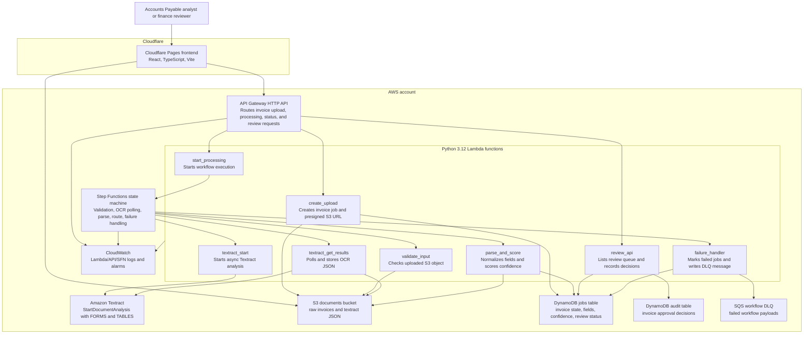

# Architecture

DocuFlow OCR is a product-facing accounts payable invoice-processing system with a Cloudflare Pages frontend and a serverless AWS backend deployed with Terraform. The system accepts invoice PDFs/images through a presigned S3 upload flow, stores job state in DynamoDB, uses Step Functions to orchestrate asynchronous Textract OCR, parses normalized invoice fields in Python Lambda, and routes uncertain totals or vendor fields to a finance review API.

## Container Diagram



## Runtime Flow

1. A user opens the Cloudflare Pages frontend.
2. The frontend calls `POST /uploads` with an invoice filename, content type, and optional owner ID.
3. `create_upload` creates a DynamoDB invoice job item in `CREATED` status and returns a presigned S3 `PUT` URL.
4. The frontend uploads the invoice PDF or image directly to S3 under `raw/{owner_id}/{job_id}/{filename}`.
5. The frontend calls `POST /jobs/{job_id}/start` when the upload is complete.
6. `start_processing` marks the job `PROCESSING` and starts a Step Functions execution.
7. The workflow validates the S3 object, starts Textract document analysis, waits, and polls for completion.
8. `textract_get_results` stores raw Textract JSON in S3 under `textract/{job_id}/raw.json`.
9. `parse_and_score` extracts normalized invoice fields, calculates confidence, and updates DynamoDB.
10. High-confidence invoice jobs become `COMPLETED`; low-confidence or incomplete jobs become `NEEDS_REVIEW`.
11. Review endpoints list queued invoice jobs, return extracted fields, accept corrections, and write approve/reject audit records.
12. Workflow failures are marked `FAILED` and sent to the SQS DLQ.

## Deployment Shape

Cloudflare Pages hosts:

- A React/Vite frontend in `frontend/`.
- Demo mode when `VITE_API_BASE_URL` is unset.
- Live API mode when `VITE_API_BASE_URL` points at the deployed API Gateway URL.

Terraform creates:

- API Gateway HTTP API routes for upload, job status, processing start, and review decisions.
- Lambda functions packaged from `src/lambdas/*` by `scripts/package_lambdas.py`.
- A Step Functions state machine that invokes workflow Lambdas and handles polling, retries, catches, and routing.
- An S3 bucket for raw uploaded documents and raw Textract output.
- DynamoDB tables for job state and review audit records.
- An SQS DLQ for failed workflow payloads.
- CloudWatch log groups and alarms for failed Step Functions executions and DLQ depth.
- IAM roles and policies scoped to the generated project resources where practical.

The deployment flow is:

```bash
make install
make test
make package
terraform -chdir=infra init
terraform -chdir=infra apply
npm --prefix frontend install
npm --prefix frontend run build
npm --prefix frontend exec wrangler pages deploy dist --project-name docuflow-ocr --branch main
```

## Key Constraints

- There is no hosted demo URL committed in the repository.
- The frontend includes demo mode for hiring walkthroughs and API mode for real deployments.
- The API has no authentication in version 1; production use would require auth and owner-scoped authorization.
- S3 event triggers are intentionally not used; the explicit start endpoint keeps the demo deterministic.
- Textract is asynchronous and per-page billed, so test with small synthetic documents.
- Parser tests use mock Textract fixtures and do not prove live Textract accuracy for every document type.
- The first version favors portfolio clarity over production features such as multi-tenant auth, payment processing, custom ML, and long-term retention policies.
